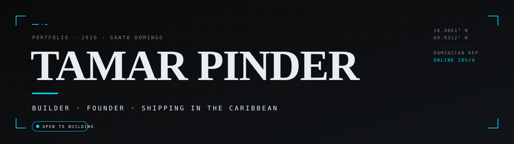

<div align="center">
  
</div>

<br/>

Solo developer based in Santo Domingo, shipping full production software for the Caribbean. I build the whole stack — database schema, customer apps, vendor dashboards, admin panels, payment rails, deploys — for my own products and for clients. Currently running my main bet alongside three live engagements. The work is the lifestyle: sixteen hours at the keyboard, one in the gym, the rest is sleep.

<br/>

## <samp>NOW</samp>

- Polishing FemFuel post-launch — UX refinements, content, conversion details
- Recording the first wave of customer onboarding videos
- Architecting Kalypso's wallet + virtual-account stack
- Active engagement on a heavy-machinery rental admin platform
- Working through the Anthropic Skilljar curriculum end-to-end

<br/>

## <samp>FEATURED WORK</samp>

<table>
  <tr>
    <td width="50%" valign="top">
      <h3><a href="https://femfuel.do">FemFuel Beauty</a> &nbsp;<sub><code>LIVE · PRIMARY</code></sub></h3>
      <p>The booking layer for the Dominican beauty market. Three apps — customer, vendor, admin — Stripe payments under a Pattern A merchant-of-record model, full RNC compliance, vendor wallet with ITBIS transparency, courier dispatch for product orders. Spanish-first, brand-aligned end to end.</p>
      <p><sub><code>Next.js 15 · React 19 · Supabase · Stripe · Tailwind v4</code></sub></p>
    </td>
    <td width="50%" valign="top">
      <h3>Kalypso &nbsp;<sub><code>BUILDING</code></sub></h3>
      <p>Crypto on-ramp / off-ramp for the Caribbean. Crypto credit cards, virtual US accounts, custody wallet, and crypto ATMs on the roadmap. Designed for Caribbean fiat rails first, not retrofitted from US-only infra.</p>
      <p><sub><code>Wallet · Custody · Virtual Accounts · Card Issuing</code></sub></p>
    </td>
  </tr>
  <tr>
    <td width="50%" valign="top">
      <h3>Dauro &nbsp;<sub><code>SHIPPED · CLIENT</code></sub></h3>
      <p>End-to-end rental car booking platform for a Dominican client. Customer-facing reservation flow plus full admin panel for fleet, pricing, and bookings.</p>
      <p><sub><code>Next.js · Postgres · Admin tooling</code></sub></p>
    </td>
    <td width="50%" valign="top">
      <h3>Heavy Machinery Platform &nbsp;<sub><code>ACTIVE · CLIENT</code></sub></h3>
      <p>Rental + dispatch frontend and admin panel for a heavy-equipment operator. In active development.</p>
      <p><sub><code>Next.js · Operations dashboards</code></sub></p>
    </td>
  </tr>
</table>

<br/>

## <samp>STACK</samp>

```
Build      Next.js 15 · React 19 · TypeScript 5 strict · Tailwind v4
Data       Supabase · Postgres · Row-Level Security · Realtime
Pay        Stripe Connect · Apple Pay · Google Pay · Pattern A merchant-of-record
Ship       Vercel · GitHub Actions · Sentry-bound (next)
Practice   Claude Opus + Sonnet · Anthropic Skilljar · Cursor-class workflows
Off-keys   Gym daily · Caribbean coffee · No social media noise
```

<br/>

## <samp>HOW I BUILD</samp>

<table>
  <tr>
    <td><strong>Solo developer.</strong></td>
    <td>Every line shipped is mine. I run a tight workflow with Claude as my pair — architecture, debugging, design reviews, second opinions — but the calls and the code are mine. Disciplined process, real leverage.</td>
  </tr>
  <tr>
    <td><strong>End-to-end.</strong></td>
    <td>Database schema to deploy. Customer app, vendor dashboard, admin panel, payment rails — all built and shipped together. No half-finished prototypes, no tomorrow's-problem architecture.</td>
  </tr>
  <tr>
    <td><strong>Caribbean-first, not Caribbean-also.</strong></td>
    <td>Most fintech and SaaS treats LATAM as a bolt-on. I design for it from the schema up — RNC validation, ITBIS handling, DOP-native math, Spanish-first UX.</td>
  </tr>
  <tr>
    <td><strong>Taste matters.</strong></td>
    <td>Self-hosted typography, brand-aligned components, tokens that mean something. The work should look like the work.</td>
  </tr>
</table>

<br/>

## <samp>SIGNALS</samp>

<p align="left">
  
  
</p>

<p align="left">
  
</p>

<br/>

## <samp>CONTRIBUTIONS</samp>

<picture>
  <source media="(prefers-color-scheme: dark)" srcset="https://raw.githubusercontent.com/tamarpinder/tamarpinder/output/github-snake-dark.svg"/>
  <source media="(prefers-color-scheme: light)" srcset="https://raw.githubusercontent.com/tamarpinder/tamarpinder/output/github-snake.svg"/>
  
</picture>

<br/>
<br/>

## <samp>CONNECT</samp>

<p>
  <a href="https://femfuel.do"><code>femfuel.do</code></a> &nbsp;·&nbsp;
  <a href="mailto:tamarpinder@gmail.com"><code>tamarpinder@gmail.com</code></a> &nbsp;·&nbsp;
  <a href="https://github.com/tamarpinder"><code>github / tamarpinder</code></a>
</p>

<br/>

<sub><em>Open to building. Caribbean-based. Async-friendly. Bring me a hard problem.</em></sub>
